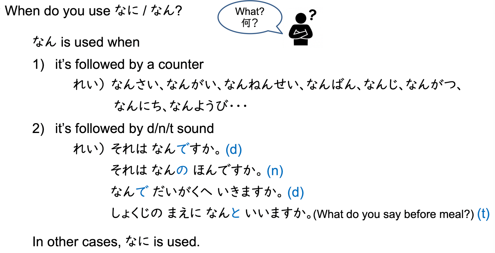
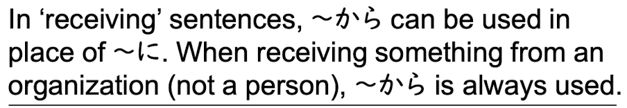
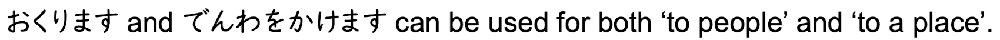
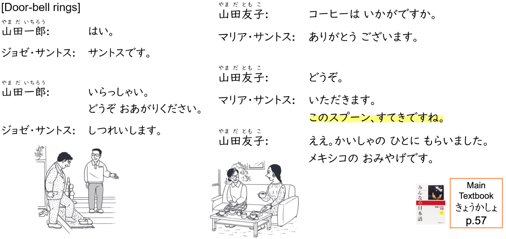

## Sentences

- L1
    - How do you do (first meeting): はじめまして。
    - Nice to meet you (ask someone to do you a favour): どうぞよろしくおねがいします。
    - I am from ...:  ...からきました。
    - How old are you (polite): おいくつですか。
    - How old are you: なんさいですが。
    - Excuse me / I might be being rude, but...: しつれいですが、〜
    - What is your name: おなまえは。
    - This is Mr Miller: こちらはミラーさんです。
    - Excuse me: すみません。
    - Not ...: ...じゃありません。
    - Who is that person: 
        - Normal: あのひとわだれですかか。
        - Polite: あのかたわどなたですか。
    - Hello: おはようございます。
- L2
    - That's right: そうです。
    - That's wrong: ちがいます。
    - I see: そうですか。
    - Well...: あのう...
    - Oh? What: えっ。
    - Oh : あ...
    - Thank you very much: どうもありがとうございます。
    - I hope for your kind assistance hereafter: これからおせわになります。
    - I am pleased to meet you too: こちらこそおねがいします。
    - Emm... This is a souvenir from Japan: あのう、これ、にほんのおみやげです。どうぞ。
    - What is that: それはなんですか？
    - Who is the owner of that pen: そのペンはだれのですか。/それはだれの（ほん）ですか。
    - What is this book about: それはなんのほんですか。
    - That person is A or B: あのひとはAさんですか、Bさんですか。
    - Good Moring: こんにちは。
- L3

    - Which floor got shoe section: くつうりばはなんかい（どちら）ですか。
    - Where is the toilet: あのう、すみません。おてあらいはどちら（どこ）ですか。
    - Where is the dictionary: じしょはどこですか。
    - It's inside the room: へやです。
    - Here: ここです。
    - How much is this unbrella: すみません、このかさはいくらですか。
    - Welcome／May I help you: いらっしゃいませ。
    - Please show me that wine: そのワインをみせてください。
    - Then... じゃ、
    - Then, I will have this: じゃ、これをください。
    - Thanks for buying: ありがとうございます。
    - Which country are you from: おくにはどちらですか。
    - What is IMC.inc about: IMCはなんのかいしゃですか。
    - Where is this watch from?(brand/country of production): それはどこのとけいですか。
    - My (computer) is Macbook: わたしのはMacBookです。
- L4

    - That's tough, isn't it? たいへんですね！
    - What time is it now: いま、なんじですか。
    - Japanese class on Monday is from 4:00: げつようびのにほんごのクラスはよじからです。
    - This test is until 5:30: このテストはここごじはんまでです。
    - It takes 30min from my home to the university: うちからだいがくまで３０ぷんです。
    - Today's homework is Hiragana and Katakana practice: きょうのしゅくだいは、ひらがなとかたかなのれんしゅうです。
    - Every night I study until 1am: まいばん１じまでべんきょうします。
    - Everyday I study from 8 to 12: まいにち８じから４じまでべんきょうします。
    - I work on Sat and Sun, too: どようびとにちようびもはたらきます。
    - What is your telephone number: でんわばんごうはなんばんですか。
    - When will your place ON until: そちらはなんじまでですか。
    - Confirm tel no: 123-456-78ですね。
    - そうです３types:
        - That's right: そうです。
        - I see: そうですか。
        - I agree: そうですね。
    - What time is it in Tokoyo now: とうきょうはいまなんじですか。
    - From what time to what time is the lunch break: ひるやすみはなんじからなんじまでですか。
    - From what time to what time will you study on Monday: げつようびはなんじからなんじまでべんきょうしますか。
    - Holiday is Sunday and Monday: やすみはにちよびとげつようびです。
    - On Sat, I work from 3:00 to 6:00: どようびは３じから６じまではたらきます。
    - Time に Verb
        - Every morning, I wake up at 7am: まいあさ７じにおきます。
        - Class ends at 6:00: クラスは６じにおわります。
        - 　At what time do you wake up on Monday: げつようびはなんじにおきます。
        - When time expression is the subject of the sentence, use は。
            - きょうはげつようびです。
        - Other situations, は can be used for highlighting.
            - きのうは１２じにねます。(Yesterday is special)
        - １２３４の４５６７（の for -)
        - 
    - 
    - 
- L5
    - I went to the library last Saturday: せんしゅうのどようびにとしょかんていきました。
    - Did you go to the librrary yesterday? きのうとしょかんへいきましたか。
    - Yes, I did: はい、いきました。
    - I work in Dec every year: まいとし(no の！)１２がつにはたらきます。
    - When is your birthday: たんじょうびはいつですか。
    - This cake is delicious: このケーキはおいしいですね！
    - Next train is express train: つぎのでんしゃはきょこうです。
    - What date is next Monday: らいしょうのげつようびはなんにちでづか。
    - I came to Singapore in January this year: ことしの１がつにシンガポールへきました。
    - I went home at 6:00 yesterday: きのう６じにうちへかえりました。
    - I am coming: いま、いきます。
    - Where are you going tomorrow: あしたどこへいきますか。
    - Not going anywhere: どこもいきません。
    - I go to university by no.151 bus every day: まいにち１５１ばんのバスでだいがくへいきます。
    -  How A san go to university every day: Aさんはまいにちなんで（どうやって）だいがくへいきますか。
    - I walk there: あるいていきます。
    - From here to NUS, how to go: ここからNUSまでなんでいきますか。
    - Who are you going to the museum with tomorrow: あしただれとびじゅつかんへいきますか。
    - I went along: ひとりでいきます。
    - You are welcome: どういたしまして。
    - 
    - 
- L6
    - That`s good: いいですね。
    - I see/I got it: わかりました。
    - See you tomorrow: じゃ、またあした。
    - Yes? / What is it?: なんですか。
    - Lets studay JAP together: いっしょににほんごをべんきょうしましょう!
    - Today, took photo with Sato-san: きのう、さとさんと いっしょに しゃしんを とりました。
    - Jap class is a bit hard but interesting: にほんごの クラスは、ちょっとたいへです。でも、おもしろいです。
    - Please wait a moment: ちょっとまってください。
    - How do you always go to university by?: Aさんは、いつもなんで だいがくにいきますか。
    - I always eat dinner at home, sometimes eat in canteen: いつもうちでばんごはんをたべます。ときどきしょくどうでたべます。
    - Sometimes I also play tennis: ときどきサッカーもします。
    - Sometimes I eat at home with my family: ばんごはんはいつもかぞくとうちでたべます。
    - Sunday I wrote my homework, then meet with friends: にちようびはしゅくだいをしました。それから、ともだちにあいました。
    - Object を Verb
    - Place で Action-verb
    - I study in library: としょかんでべんきょうします。
    - Today where are you going to eat lunch today?: きょうはどこで ひるごはんを たべますか。
    - What do you eat every morning?: まいあさなにをたべますか。
        - I eat bread: パンをたべます。
        - I don't eat: なにもたべません。
    - I don't meet anyone: だれにもあいません
    - No one comes: だれもきません
    - (Emphasis the date) What do you do on Sun: にちようびはなにをしますか。
    - 
    - Why don't we eat lunch together?: いっしょにひるごはんをたべませんか。
    - Tmr is a little bit hard for me: あしたはちょっと・・・
    - Let's go canteen!: じゃ、しょくどうへいきましょう。
    - See you next time( this time cannot): じゃ、またこんど。
    - When do you watch cherry bloosm this year?: ことしはいつおはなみおしますか。
    - Can you also come with us?:　ミラさんもいっしょにいきませんか。
- L7
    - What a nice: 〜、すてきですね。
    - This shirt is so nice: そのシャツ、すてきですね！
    - I received from my mother on my birthday: たんじょうびにははにもらいました。
    - Welcome: いらっしゃい。
    - May I come in: しつれいします。
    - Please come in: どうぞおあがりください。
    - Would you like to have --? [〜は]いかがですか。
    - Greeting before eating: いただきます。
    - Greeting after eating: ごちそうさまでした。
    - Have you already eaten lunch?: もうひるごはんをたべましたかか。
      - はい、（もう）たべました。
      - いいえ、まだです。
      - I will do it now: これからします。
    - From now on, where will you go?: これから、どこへいきますか。
    - I cut the paper using scissors: はさみでかみをきります。
    - Using: Object で Object を Action-verb
    - Someone に (Something を) Action-verb
    - How do you eat lunch?: なんでおすしをたべますか。
    - How to say "Thank you" in Japanese?: 'Thank you' はにほんごでなんですか。
    - On Christmas last year, Tanaka-san gave flowerrs to Sato-san: きょねんのクリスマスになたかさんはさとさんにはなをあげました。
    - 
    - 
    - Who do you receive present from?: だれにプレゼントをもらいましたか。
    - 
- L8
    - How are you?: おげんきですか。
    - I am fine!: はい、げんきです。
    - How is life in SG?: Singaporeのせいかつはどうですか。
    - Everyday quite busy but enjoyable: まいにちいそがしいですが、たのしいです。
    - Very convenient and enjoyable: とてもべんりです。そして、たのしいです。
    - When did you came to SG?: AさんはいつSingaporeへきましたか。
    - How is your job?: おしごとはどうですか。
    - Very enjoyable: とてもたのしいです。
    - Please come: いらっしゃってくださいね！
    - Not very busy: Aはあまりいそがしくないです。
    - Not at all: Aはぜんぜんさむくないです
    - Do you want to have another cup of coffee?: 「」もういっぱいいかがですか。
    - No thanks. いいえ、けっこうです。
    - It's already 6:00, It's time to leave: もう６じですね。そろそろしつれいします。
    - Thank you for everything today: きょうはどうもありがとうございました。
    - Not at all, please come again: いいえ、またいらっしゃってください。
    - What kind of city is Nara?: ならですか。ならはどんなまちですか。
    - なADJ: 
        - 〜は〜じゃありません。
        - 〜は〜「Noun」じゃないです。
        - なADJな　＋　Noun
        - きれいなはなです。
    - いADJ:
        - 〜は〜くないです。(Remove い)
        - 〜はいいです。→　〜はよくないです。
        - いADJ　＋　Noun
        - たかいやまです。
    - No matter い/な、if adj+Noun then → adj+Nounじゃありません。
- L9
    - Won't you join us: いっしょにいかがですか。
    - ~ is a bit difficult: 〜はちょっと・・・
    - So you can't?:だめですか。
    - Please ask me again some other time: またこんどおねがいします。
    - Please lend it to me: かしてください。
    - Sure!: ええ、いいですよ。どうぞ。
    - Do you understand ENG: Aさんはえいごがわかりますか。
    - Do you also understand ENG: Aさんはえいごもわかりますか。
    - Yes, I understand well: はい、よくわかります。
    - No, I don't understand Korean at all: いいえ、かんこくごはぜんぜんわかりません。
    - Today I will leave early: きょうは、はやくかえります。
    - Why yesterday you didn't attend class?: どうしてきのうクラスにきませんでした。
    - Because ~: 〜から、
    - Why?: どうしてですか。
    - What a pity: ざんねんですね。
    - I am sorry, but I got things to do today: ざんねんですが、きょうはようじがあります。
    - How about Sunday: にちようびはどうですか。
    - Hi, is it Bさん?This is Aさん: もしもし、Bさんですか。Aさんです。
    - A have a car: Aさんはくるまがあります。
    - A also have a big house: おおきいうちもあります。
    - Don't have time!: じかんはぜんぜんありません。
    - あります・わかります
        - A lot: たくさん vs よく(だいたい for mostly)
        - A bit: すこし/ちょっど
        - Not much: あまり〜ません
        - Not at all: ぜんぜん〜ません
    - I like JAP cook: にほんりょうりがすきです。
    - I don't very like tampera: たんぷらはあまりすきじゃないです。
    - I don't like wine: ワインがきらいです。
    - What kind of ~ do you like: どんな〜がすきですか。(While なんの is for the topic/content of 〜)
    - I like various kinds of ~: いらいらな〜がすきです。
    - What's your favourite sports: すきなスポーツはなんですか。
    - My mom is good at cooking but I am not good at it: はははりょうりがじょうずです。でも、わたしはりょうりがへたです。
    - Because A so B: Aから、B
    - Why?: どうして〜。
    - Why?: どうしてですか。
- L10: 
    - There are desk and chair in the room: へやのなかにつくえといすがあります。
    - There is student: がくせいがいます。
    - Between A and B: AとBのあいだに
    - What is there?: なにがありますか。
    - Who is there?: だれがいますか。
    - Nothing: なにもありません。
    - Aはかいだんのひだりにあります。
    - Where is A: Aはどこにありますか。
    - Now, no one is in the room: いま、うちにだれもいません
    - 

## Words

- L1
    - That person: 
        - Normal: あのひと
        - Polite: あのかた
    - Girl name's suffix: 〜ちゃん
    - Nation's suffix: ~じん
    - Bank Employee: ぎんこういん
    - I: わたし
    - You: あなた
    - All of your: みなさん
    - We: わたしたち
    - Mr. /Mrs. : ~さん
    - Teacher: 
        - Polite Call: せんせい
        - Occupation: きょうし
    - Student: がくせい
    - Company Employee: かいしゃいん
    - Medical Doctor: いしゃ
    - Employee of ~: 〜しゃいん
    - **Researcher**: けんきゅうしゃ
    - University: だいがく
    - Hospital: びょういん
    - Who:
        - Normal: だれ
        - Polite: どなた
    - Yes: はい
    - No: いいえ
    - NUS: シンガポールこくりつだいがく
    - Major: 
        - せんこう
        - せんもん
    - Years old: 〜さい
    - How old: なんさい
    - What year of study: なんねんせい
        - いちねんせい
        - にねんせい
        - さんねんせい
        - よねんせい
    - 20 years old: はたち
    - Too: も
    - 
    - 
    - 
    - 
    - 

- L2
    - This one: これ
    - This: この
    - That one: それ
    - That: その
    - Far that one: あれ
    - Far that: あの
    - Book: ほん
    - Dictionary: じしょ
    - Textbook: きょうかしょ
    - Magazine:ざっし
    - Newspaper: しんぶん
    - Notebook: ノート
    - Pocket Notebook: てちょう
    - Busniess Card: めいし
    - Card: カード
    - Pencil: えんぴつ
    - Ballpoint Pen: ボールペン
    - Mechanical Pencil: シャープペンシル
    - Key: かぎ
    - Watch / Clock: とけい
    - Umbrella: かさ
    - Bag: かばん
    - TV: テレビ
    - Radio: ラジオ
    - Camera: カメラ
    - PC: 
        - コンピューター
        - パソコン
    - Car: くるま
    - Mobile Phone: けいたいでんわ
    - Desk: つくえ
    - Chair: いす
    - Chocolate: チョコレート
    - Coffe: コーヒー
    - Souvenir: おみやげ
    - English: えいご
    - Japanese: にほんご
    - Chinese: ちゅうごくご
    - ~ language: 〜ご
    - What: なん

- L3

    - Polite Suffix(noun): お〜
    - 10 cent: じゅっセント
    - Here:
        - Normal: ここ
        - Polite: こちら
    - There:
        - Normal: そこ
        - Polite: そちら
    - Far There:
        - Normal: あそこ
        - Polite: あちら
    - Where:
        - Normal: どこ
        - Polite: どちら
    - Classroom: きょうしつ
    - Canteeen: しょくどう
    - Admin Office: じむしょ
    - Meeting Room: かいぎしつ
    - Reception: おけつけ
    - Lobby: ロビー
    - Room: へや
    - Toilet:
        - トイレ
        - おてあらい
    - Staircase: かいだん
    - Elevator: エレベーター
    - Escalator: エスカレーター
    - Vending machine: じどうはんばいき
    - Telephone: でんわ
    - Country: (お)くに
    - Company: かいしゃ
    - Home: うち
    - Shoes: くつ
    - Necktie:　ネクタイ
    - Wine: ワイン
    - Department/Section of a store: うりば
    - Basement: ちか
    - ~th floor: 〜かい
    - Which floor: あんかい
    - Yen: えん
    - How much: いくら
    - Hundred: ひゃく
    - Thousand: せん
    - Ten thousand: まん
    - Dollar: ドル
    - Cents: セント
    - 
    - 

- L4

    - Art museum: びじゅつかん
    - Wake up: おきます
    - Sleep: ねます
    - Work: はたらきます
    - Take a rest: やすみます
    - Study: べんきょうします
    - Finish: おわります
    - Department Store: デパート
    - Bank: ぎんこう
    - Post office: ゆうびんきょく
    - Library: としょかん
    - Now: いま
    - O'clock: 〜じ
    - Minutes: 〜ぷん
    - Half past: 〜はん
    - What time: なんじ
    - What minute: なんぷん
    - AM: ごぜん
    - PM: ごご
    - Morning: あさ
    - Noon: ひる
    - Night: 
        - よる
        - ばん
    - The day before yesterday: おととい
    - Yesterday: きのう
    - Today: きょう
    - Tomorrow: あした
    - The day after tomorrow: あさって
    - This morning: けさ
    - Tonight: こんばん
    - Holiday: やすみ
    - Lunch break: ひるやすみ
    - Exam: しけん
    - Meeting: かいぎ
    - Movie: えいが
    - Part time job: アルバイト
    - Every: まい
    - Monday: げつようび
    - Tuesday: かようび
    - Wednesday: すいようび
    - Thursday: もくようび
    - Friday: きんようび
    - Saturday: どようび
    - Sunday: にちようび
    - What day of the week: なんようび
    - From: から
    - To/Until: まで
    - And: noun と noun
    - Telephone number: でんわばんごう
    - What number: なんばん
    - Empathy/Agrrement: ~ね
    - 
    - 

- L5
    - Last week: せんしゅう
    - This week: こんしゅう
    - Next week: らいしゅう
    - Last month:さんげつ
    - This month: こんげつ
    - Next month: らいげつ
    - Which month: なんがつ
    - Last last year: おととし
    - Last year: きょねん
    - This year: ことし
    - Next year: らいねん
    - Which year: なんねん
    - Birthday: たんじょうび
    - School:がっこう
    - When: いつ
    - Go: いきます
    - Come: きます
    - Return: かえります
    - Supermarket: スーパー
    - Station: えき
    - Airplane: ひこうき
    - Ship: ふね
    - Traain: でんしゃ
    - Subway: ちかてつ
    - Taxi: タクシー
    - Bullet train: しんかんせん
    - Bicycle: じてんしゃ
    - On foot: あるいて
    - Person: ひる
    - Friend: ともだち
    - Girlfriend: かのじょ
    - Boyfriend: かれ
    - Family: かぞく
    - Alone: ひとりで
    - Bus: バス
    - Normal train: ふつう
    - Rapid / Express train: きゅうこう
    - Super-express train: とっきゅう
    - 〜th platform: 〜ばんせん
    - Next-: つぎの〜
    - 4 year: よねん
    - April: しがつ
    - July: しちがつ
    - September: くがつ
    - 
    - 
    - 

- L6

    - Eat: たべます
    - Drink: のみます
    - Watch: みます
    - Hear/Listen: ききます
    - Read: よみます
    - Write/Draw: かきます
    - Buy: かいます
    - Do\Play: します
    - Meet a friend: ともだち　に　あいます
    - Take a photo: しゃしんをとります
    - Smoke: たばこをすいます
    - Meal/Rice: ごはん
    - Breakfast: あさごはん
    - Lunch: ひるごはん
    - Dinner: ばんごはん
    - Bread: パン
    - Egg: たまご
    - Meat: にく
    - Fish: さかな
    - Vegetable: やさい
    - Fruit: くだもの
    - Water: みず
    - Tea: おちゃ
    - English tea: こうちゃ
    - Milk: 
        - ぎゅうにゅう
        - ミルク
    - Juice: ジュース
    - beer: ビール
    - Alcohol/Japanese sake: おさけ
    - Letter: てがみ
    - Report: レポート
    - Video: ビデオ
    - Shop: みせ
    - Garden: にわ
    - Homework: しゅくだい
    - Tennis: テニス
    - Soccer: サッカー
    - Cherry blossom viewing: はなみ
    - What: なに
    - Together: いっしょに
    - A little bit: ちょっと
    - Always: いつも
    - Sometimes: ときどき
    - After that/And then: それから
    - From now on: これから
    - Yes: ええ

- L7
    - Cut: きります
    - Send: おくります
    - Give: あげます
    - Receive: もらいます
    - Lend: かします
    - Borrow: かります
    - Teach: おしえます
    - Learn: ならいます
    - Make phone call: でんわをかけます
    - Hand: て
    - Chopsticks: はし
    - Spoon: スプーン
    - Knife: ナイフ
    - Fork: フォーク
    - Scissors: はさみ
    - PC: パソコン
    - Mobile Phone: ケータイ
    - E-mail: メール
    - New Year's Greeting Card: ねんがじょう
    - Hole Puncher: パンチ
    - Stapler: ホッチキス
    - Scotch Tape: セロテープ
    - Eraser: けしゴム
    - Paper: かみ
    - Flower: はな
    - Shirt: シャツ
    - Present: プレセンと
    - Parcel: にもつ
    - Money: おかね
    - Ticket: きっぷ
    - Christmas: クリスマス
    - My father: ちち
    - My bother: はは
    - Someone's Father: おとうさん
    - Someone’s Mather: おかあさん
    - Already: もう
    - Not yet: まだ
    - From now on, soon; これから

- L8

    - Handsome: ハンサム
    - Beautiful: きれい「な」
    - Quiet: しずか
    - Lively: にぎやか
    - Famous: ゆうめい「な」
    - Kind: しんせつ
    - Healthy: げんき
    - Free: ひま
    - Convenient: べんり
    - Nice: すでき
    - Big: おおきい
    - Small: ちいさい
    - New: あたらしい
    - Old: ふるい
    - Good: いい
    - Bad: わるい
    - Hot: あつい
    - Cold
        - For Weather: さむい
        - To Touch: つめたい
    - Difficult: むずかしい
    - Easy / Gentle: やさしい
    - Expensive / Tall: たかい
    - Cheap: やすい
    - Low: ひくい
    - Intersting: おもしろい
    - Delicious: おいしい
    - Busy: いそがしい
    - Enjoyable: たのしい
    - White: しろい
    - Black: くろい
    - Red: あかい
    - Blue: あおい
    - Cherry: さくら
    - Mountain: やま
    - Town / City: まち
    - Food: たべもの
    - Place: ところ
    - Domitory: りょう
    - Resteraurant: レストラン
    - Life: せいかつ
    - Work: （お）しごと
    - How: どう
    - What kind of: どんな〜
    - Very: とても
    - Not very: あまり
    - And: そして
    - But: 〜が、〜
    - れきしがながい　くに
    - おとしより

- L9

    - Understand: わかります
    - Have: あります
    - Like: すき[な]
    - Dislike: きらい[な]
    - Good at: じょうず[な]
    - Poor at: へた[な]
    - Drinks: のみもの
    - Dish (Cooked food) / Food: りょうり
    - Cook: りょうりをします
    - Sports: スポーツ
    - Baseball: やきゅう
    - Dance: ダンス
    - Travel: りょこうをします
    - Trip: りょこう
    - Classical Music: クラシック
    - Jazz: ジャズ
    - Music: おんがく
    - Concert: コンサート
    - Song: うた
    - Karaoke: カラオケ
    - Hiragana: ひらがな
    - Katakana: かたかな
    - Ticket: チケット
    - Promise: やくそくをします
    - Kabuki: かぶき
    - Part time job: アルバイト
    - Picture/Drawing: え
    - Well/Much/Often: よく
    - Mostly/Roughly: だいたい
    - Many/Much: たくさん
    - A little/A few: すこし
    - Not at all (used with negatives): ぜんぜん
    - Letter/Character: じ
    - Chinese character: かんじ
    - Because: 〜から
    - Why: どうして
    - Roman alphabet: ローマじ
    - Small change: こまかいおかね
    - Sure/Certainly: いいですよ。
    - Unfortunately: ざんねんですが、
    - Time: じかん
    - Errand/Something to do: ようじ
    - Promise/Appointment: やくそく
    - (someone else's) Husband: ごじゅじん
    - (my) Husband: おっと
    - (someone else's) Wife: おくさん
    - (my) Wife: つま
    - Child: こども
    - Early/Quickly/Fast: はやく

- L10

    - There is/Have: 
        - Something: あります
        - Someone: います

    - Various: いろいろ「な」
    - Man: おとこのひと
    - Woman: おんなのひと
    - Boy: おとこのこ
    - Girl: おんあのこ
    - Dog: いぬ
    - Cat: ねこ
    - Panda: パンダ
    - Elephant: ぞう
    - Tree: き
    - Thing: もの
    - Battery: でんち
    - Box: はこ
    - Switch: スイッチ
    - Refrigerrator: れいぞうこ
    - Table: テーブル
    - Bed: ベッド
    - Shelf: たな
    - Door: ドア
    - Window: まど
    - Postbox: ポスト
    - Building: ビル
    - Convenience Store: コンビニ
    - Park: こうえん
    - Cafe: きっさてん
    - 〜shop: 〜や
    - Bus stop: のりば
    - Prefecture: けん
    - On/Above/Over: うえ
    - Under/Below/Beneath: した
    - Front/Before: まえ
    - Back/Behind: うしろ
    - Right: みぎ
    - Left: ひだり
    - In: なか
    - Outside: そと
    - Next door: となり
    - Near: ちかく
    - Bewteen: あいだ
    - A,B and so on: AやB
    - The bottom: いちばんした
    - Corner/Section: コーナー
    - Thai fish sauce: ナンプラー

    

    

    - で：activity
- に：exsistence

