## Sentences

- L1
    - How do you do (first meeting): はじめまして。
    - Nice to meet you (ask someone to do you a favour): どうぞよろしくおねがいします。
    - I am from ...:  ...からきました。
    - How old are you (polite): おいくつですか。
    - How old are you: なんさいですが。
    - Excuse me / I might be being rude, but...: しつれいですが、〜
    - What is your name: おなまえは。
    - This is Mr Miller: こちらはミラーさんです。
    - Excuse me: すみません。
    - Not ...: ...じゃありません。
    - Who is that person: 
        - Normal: あのひとわだれですかか。
        - Polite: あのかたわどなたですか。
    - Hello: おはようございます。
- L2
    - That's right: そうです。
    - That's wrong: ちがいます。
    - I see: そうですか。
    - Well...: あのう...
    - Oh? What: えっ。
    - Oh : あ...
    - Thank you very much: どうもありがとうございます。
    - I hope for your kind assistance hereafter: これからおせわになります。
    - I am pleased to meet you too: こちらこそおねがいします。
    - Emm... This is a souvenir from Japan: あのう、これ、にほんのおみやげです。どうぞ。
    - What is that: それはなんですか？
    - Who is the owner of that pen: そのペンはだれのですか。/それはだれの（ほん）ですか。
    - What is this book about: それはなんのほんですか。
    - That person is A or B: あのひとはAさんですか、Bさんですか。
    - Good Moring: こんにちは。
- L3

    - Which floor got shoe section: くつうりばはなんかい（どちら）ですか。
    - Where is the toilet: あのう、すみません。おてあらいはどちら（どこ）ですか。
    - Where is the dictionary: じしょはどこですか。
    - It's inside the room: へやです。
    - Here: ここです。
    - How much is this unbrella: すみません、このかさはいくらですか。
    - Welcome／May I help you: いらっしゃいませ。
    - Please show me that wine: そのワインをみせてください。
    - Then... じゃ、
    - Then, I will have this: じゃ、これをください。
    - Thanks for buying: ありがとうございます。
    - Which country are you from: おくにはどちらですか。
    - What is IMC.inc about: IMCはなんのかいしゃですか。
    - Where is this watch from?(brand/country of production): それはどこのとけいですか。
    - My (computer) is Macbook: わたしのはMacBookです。
- L4

    - That's tough, isn't it? たいへんですね！
    - What time is it now: いま、なんじですか。
    - Japanese class on Monday is from 4:00: げつようびのにほんごのクラスはよじからです。
    - This test is until 5:30: このテストはここごじはんまでです。
    - It takes 30min from my home to the university: うちからだいがくまで３０ぷんです。
    - Today's homework is Hiragana and Katakana practice: きょうのしゅくだいは、ひらがなとかたかなのれんしゅうです。
    - Every night I study until 1am: まいばん１じまでべんきょうします。
    - Everyday I study from 8 to 12: まいにち８じから４じまでべんきょうします。
    - I work on Sat and Sun, too: どようびとにちようびもはたらきます。
    - What is your telephone number: でんわばんごうはなんばんですか。
    - When will your place ON until: そちらはなんじまでですか。
    - Confirm tel no: 123-456-78ですね。
    - そうです３types:
        - That's right: そうです。
        - I see: そうですか。
        - I agree: そうですね。
    - What time is it in Tokoyo now: とうきょうはいまなんじですか。
    - From what time to what time is the lunch break: ひるやすみはなんじからなんじまでですか。
    - From what time to what time will you study on Monday: げつようびはなんじからなんじまでべんきょうしますか。
    - Holiday is Sunday and Monday: やすみはにちよびとげつようびです。
    - On Sat, I work from 3:00 to 6:00: どようびは３じから６じまではたらきます。
    - Time に Verb
        - Every morning, I wake up at 7am: まいあさ７じにおきます。
        - Class ends at 6:00: クラスは６じにおわります。
        - 　At what time do you wake up on Monday: げつようびはなんじにおきます。
        - When time expression is the subject of the sentence, use は。
            - きょうはげつようびです。
        - Other situations, は can be used for highlighting.
            - きのうは１２じにねます。(Yesterday is special)
        - １２３４の４５６７（の for -)
        - 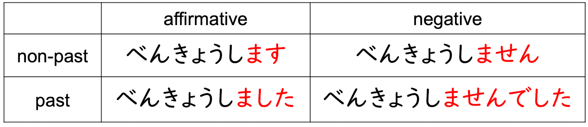
    - 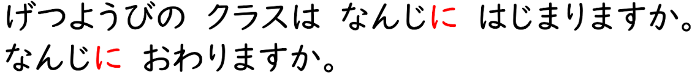
    - 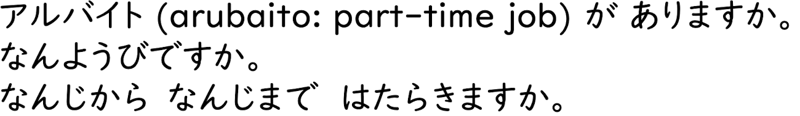
- L5
    - I went to the library last Saturday: せんしゅうのどようびにとしょかんていきました。
    - Did you go to the librrary yesterday? きのうとしょかんへいきましたか。
    - Yes, I did: はい、いきました。
    - I work in Dec every year: まいとし(no の！)１２がつにはたらきます。
    - When is your birthday: たんじょうびはいつですか。
    - This cake is delicious: このケーキはおいしいですね！
    - Next train is express train: つぎのでんしゃはきょこうです。
    - What date is next Monday: らいしょうのげつようびはなんにちでづか。
    - I came to Singapore in January this year: ことしの１がつにシンガポールへきました。
    - I went home at 6:00 yesterday: きのう６じにうちへかえりました。
    - I am coming: いま、いきます。
    - Where are you going tomorrow: あしたどこへいきますか。
    - Not going anywhere: どこもいきません。
    - I go to university by no.151 bus every day: まいにち１５１ばんのバスでだいがくへいきます。
    -  How A san go to university every day: Aさんはまいにちなんで（どうやって）だいがくへいきますか。
    - I walk there: あるいていきます。
    - From here to NUS, how to go: ここからNUSまでなんでいきますか。
    - Who are you going to the museum with tomorrow: あしただれとびじゅつかんへいきますか。
    - I went along: ひとりでいきます。
    - You are welcome: どういたしまして。
    - 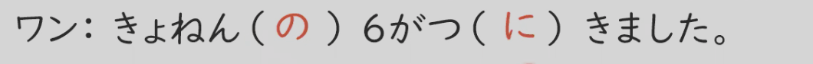
    - 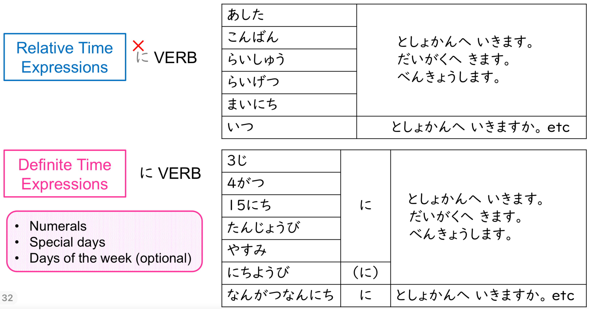

## Words

- L1
    - That person: 
        - Normal: あのひと
        - Polite: あのかた
    - Girl name's suffix: 〜ちゃん
    - Nation's suffix: ~じん
    - Bank Employee: ぎんこういん
    - I: わたし
    - You: あなた
    - All of your: みなさん
    - We: わたしたち
    - Mr. /Mrs. : ~さん
    - Teacher: 
        - Polite Call: せんせい
        - Occupation: きょうし
    - Student: がくせい
    - Company Employee: かいしゃいん
    - Medical Doctor: いしゃ
    - Employee of ~: 〜しゃいん
    - **Researcher**: けんきゅうしゃ
    - University: だいがく
    - Hospital: びょういん
    - Who:
        - Normal: だれ
        - Polite: どなた
    - Yes: はい
    - No: いいえ
    - NUS: シンガポールこくりつだいがく
    - Major: 
        - せんこう
        - せんもん
    - Years old: 〜さい
    - How old: なんさい
    - What year of study: なんねんせい
        - いちねんせい
        - にねんせい
        - さんねんせい
        - よねんせい
    - 20 years old: はたち
    - Too: も
    - 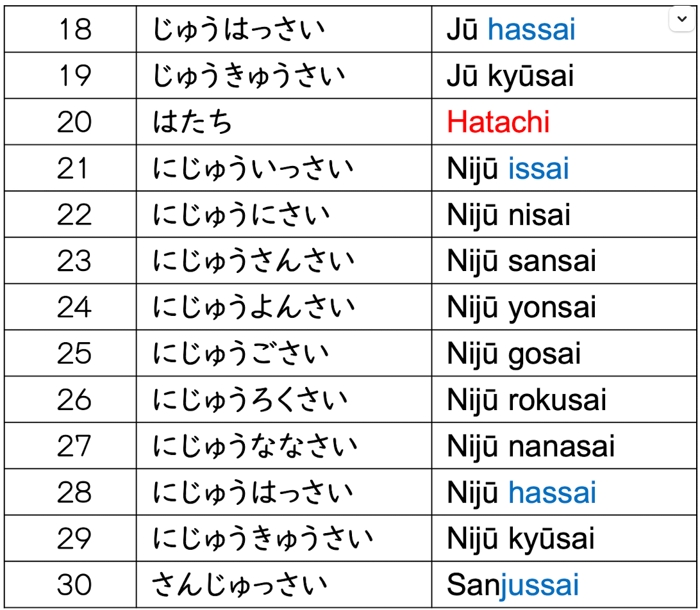
    - 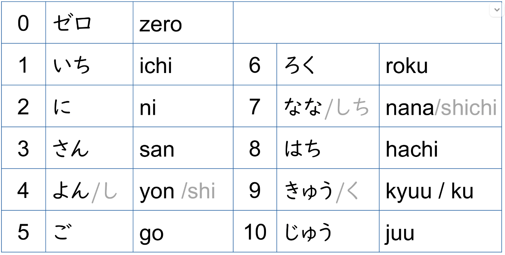
    - 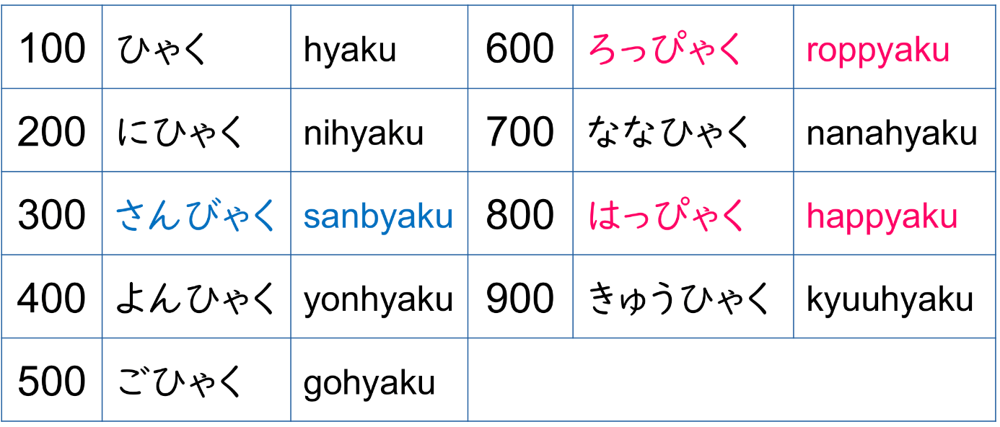
    - 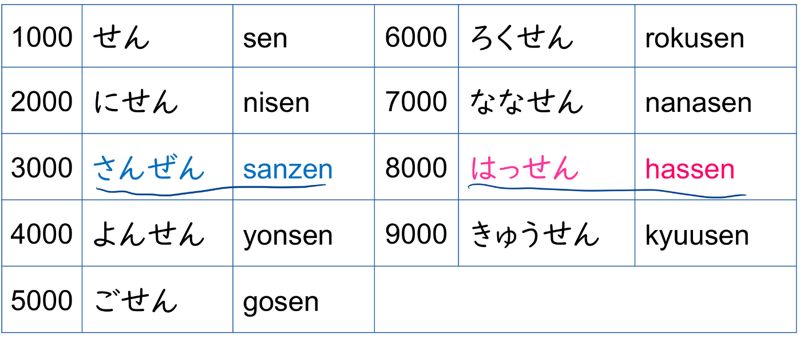
    - 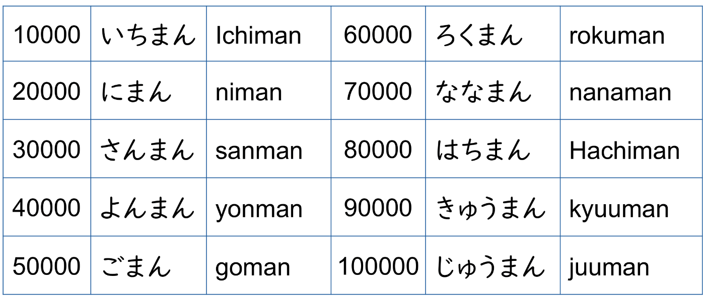
    
- L2
    - This one: これ
    - This: この
    - That one: それ
    - That: その
    - Far that one: あれ
    - Far that: あの
    - Book: ほん
    - Dictionary: じしょ
    - Textbook: きょうかしょ
    - Magazine:ざっし
    - Newspaper: しんぶん
    - Notebook: ノート
    - Pocket Notebook: てちょう
    - Busniess Card: めいし
    - Card: カード
    - Pencil: えんぴつ
    - Ballpoint Pen: ボールペン
    - Mechanical Pencil: シャープペンシル
    - Key: かぎ
    - Watch / Clock: とけい
    - Umbrella: かさ
    - Bag: かばん
    - TV: テレビ
    - Radio: ラジオ
    - Camera: カメラ
    - PC: 
        - コンピューター
        - パソコン
    - Car: くるま
    - Mobile Phone: けいたいでんわ
    - Desk: つくえ
    - Chair: いす
    - Chocolate: チョコレート
    - Coffe: コーヒー
    - Souvenir: おみやげ
    - English: えいご
    - Japanese: にほんご
    - Chinese: ちゅうごくご
    - ~ language: 〜ご
    - What: なん
    
- L3

    - Polite Suffix(noun): お〜
    - 10 cent: じゅっセント
    - Here:
        - Normal: ここ
        - Polite: こちら
    - There:
        - Normal: そこ
        - Polite: そちら
    - Far There:
        - Normal: あそこ
        - Polite: あちら
    - Where:
        - Normal: どこ
        - Polite: どちら
    - Classroom: きょうしつ
    - Canteeen: しょくどう
    - Admin Office: じむしょ
    - Meeting Room: かいぎしつ
    - Reception: おけつけ
    - Lobby: ロビー
    - Room: へや
    - Toilet:
        - トイレ
        - おてあらい
    - Staircase: かいだん
    - Elevator: エレベーター
    - Escalator: エスカレーター
    - Vending machine: じどうはんばいき
    - Telephone: でんわ
    - Country: (お)くに
    - Company: かいしゃ
    - Home: うち
    - Shoes: くつ
    - Necktie:　ネクタイ
    - Wine: ワイン
    - Department/Section of a store: うりば
    - Basement: ちか
    - ~th floor: 〜かい
    - Which floor: あんかい
    - Yen: えん
    - How much: いくら
    - Hundred: ひゃく
    - Thousand: せん
    - Ten thousand: まん
    - Dollar: ドル
    - Cents: セント
    - 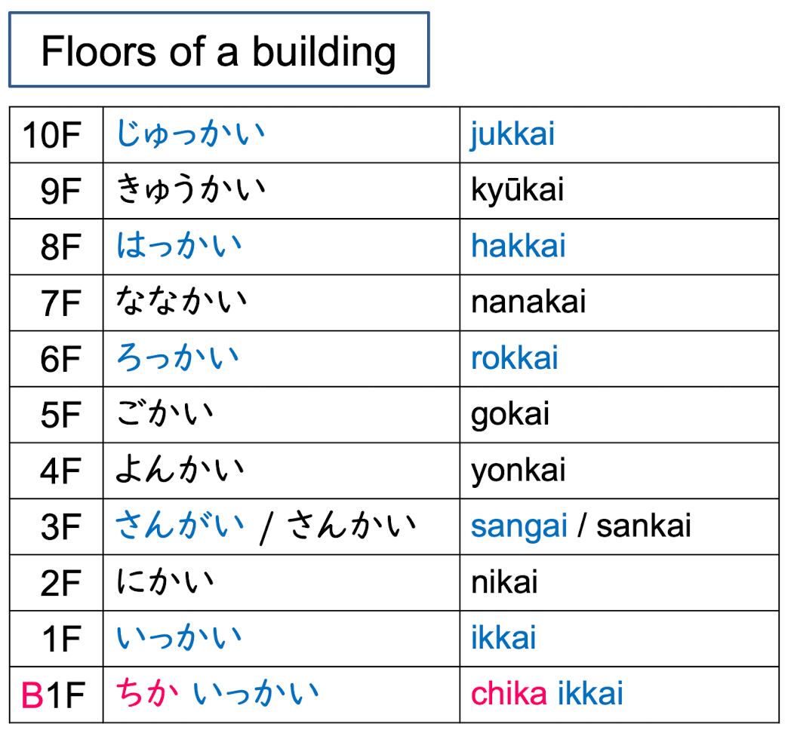
    - 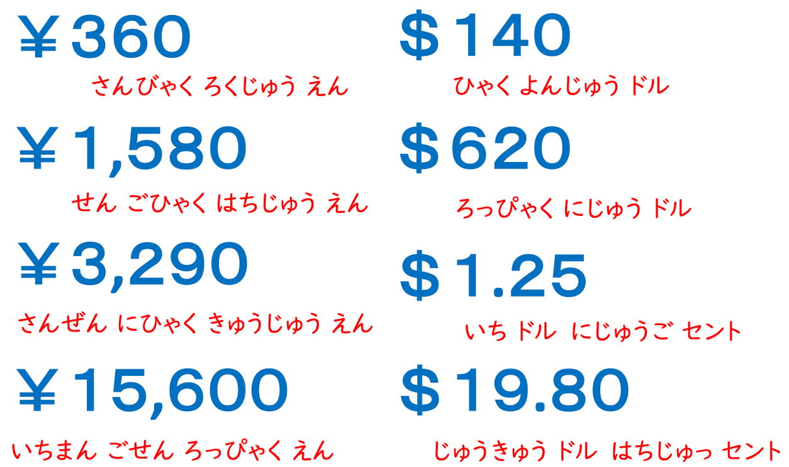

- L4

    - Art museum: びじゅつかん
    - Wake up: おきます
    - Sleep: ねます
    - Work: はたらきます
    - Take a rest: やすみます
    - Study: べんきょうします
    - Finish: おわります
    - Department Store: デパート
    - Bank: ぎんこう
    - Post office: ゆうびんきょく
    - Library: としょかん
    - Now: いま
    - O'clock: 〜じ
    - Minutes: 〜ぷん
    - Half past: 〜はん
    - What time: なんじ
    - What minute: なんぷん
    - AM: ごぜん
    - PM: ごご
    - Morning: あさ
    - Noon: ひる
    - Night: 
        - よる
        - ばん
    - The day before yesterday: おととい
    - Yesterday: きのう
    - Today: きょう
    - Tomorrow: あした
    - The day after tomorrow: あさって
    - This morning: けさ
    - Tonight: こんばん
    - Holiday: やすみ
    - Lunch break: ひるやすみ
    - Exam: しけん
    - Meeting: かいぎ
    - Movie: えいが
    - Part time job: アルバイト
    - Every: まい
    - Monday: げつようび
    - Tuesday: かようび
    - Wednesday: すいようび
    - Thursday: もくようび
    - Friday: きんようび
    - Saturday: どようび
    - Sunday: にちようび
    - What day of the week: なんようび
    - From: から
    - To/Until: まで
    - And: noun と noun
    - Telephone number: でんわばんごう
    - What number: なんばん
    - Empathy/Agrrement: ~ね
    - 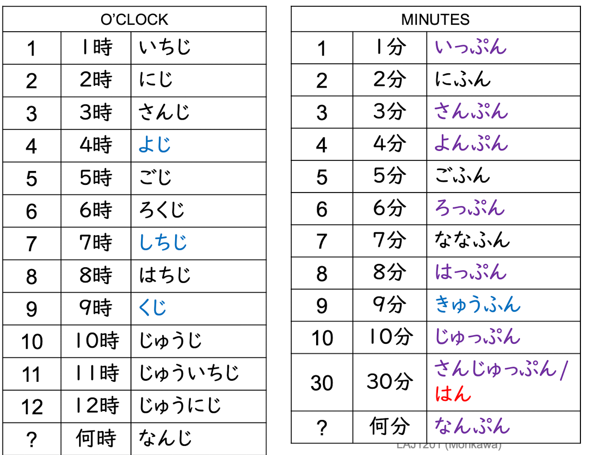
    - 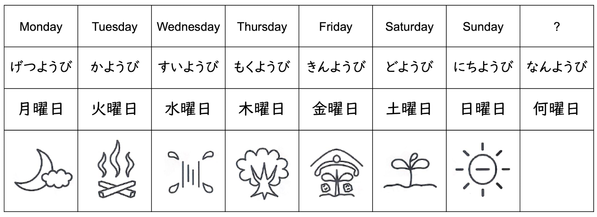
- L5
    - Last week: せんしゅう
    - This week: こんしゅう
    - Next week: らいしゅう
    - Last month:さんげつ
    - This month: こんげつ
    - Next month: らいげつ
    - Which month: なんがつ
    - Last last year: おととし
    - Last year: きょねん
    - This year: ことし
    - Next year: らいねん
    - Which year: なんねん
    - Birthday: たんじょうび
    - School:がっこう
    - When: いつ
    - Go: いきます
    - Come: きます
    - Return: かえります
    - Supermarket: スーパー
    - Station: えき
    - Airplane: ひこうき
    - Ship: ふね
    - Traain: でんしゃ
    - Subway: ちかてつ
    - Taxi: タクシー
    - Bullet train: しんかんせん
    - Bicycle: じてんしゃ
    - On foot: あるいて
    - Person: ひる
    - Friend: ともだち
    - Girlfriend: かのじょ
    - Boyfriend: かれ
    - Family: かぞく
    - Alone: ひとりで
    - Bus: バス
    - Normal train: ふつう
    - Rapid / Express train: きゅうこう
    - Super-express train: とっきゅう
    - 〜th platform: 〜ばんせん
    - Next-: つぎの〜
    - 4 year: よねん
    - April: しがつ
    - July: しちがつ
    - September: くがつ
    - 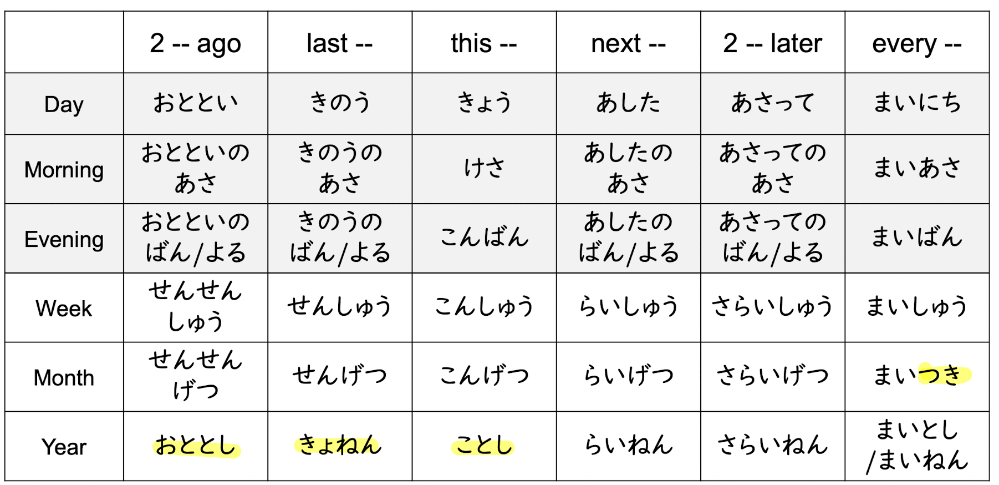
    - 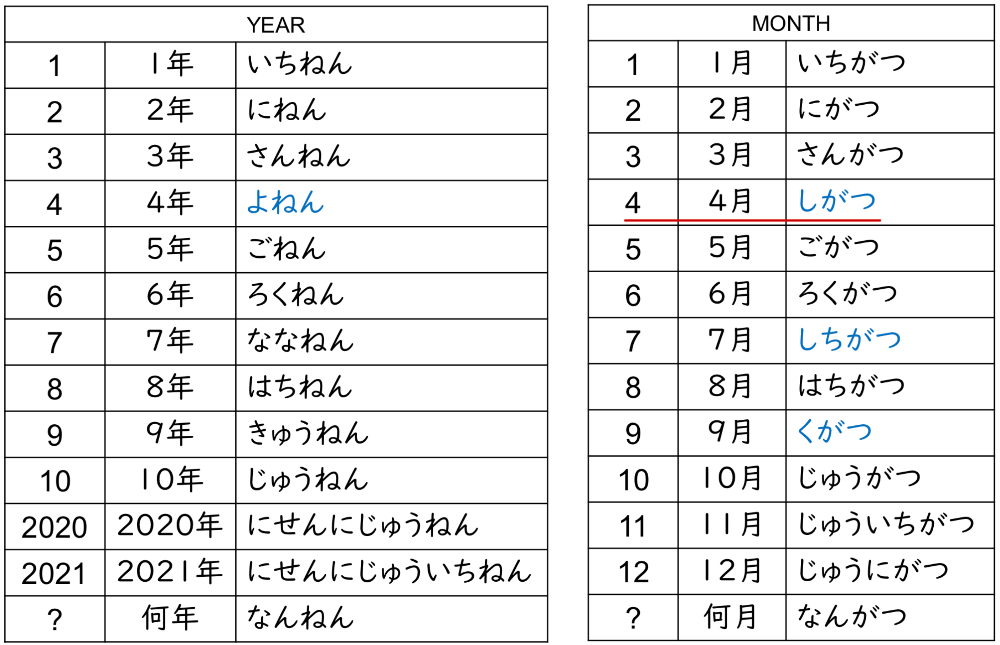
    - 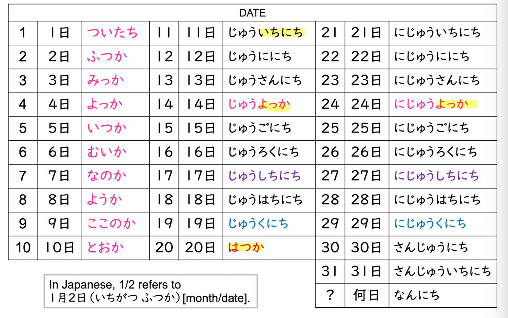
